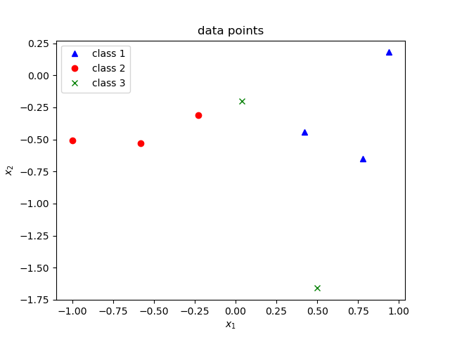
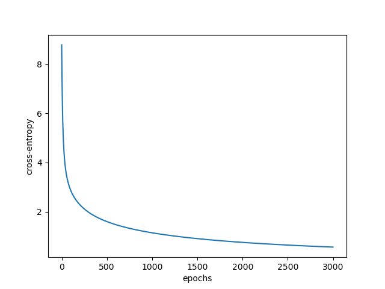
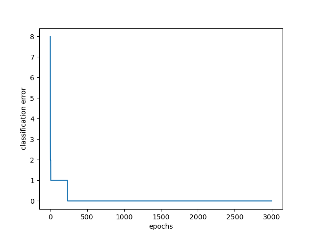

- [Example 1](#example-1)
- [Example 2 GD for softmax classification](#example-2-gd-for-softmax-classification)
- [Example 3 Softmax classification of iris data](#example-3-softmax-classification-of-iris-data)
- [Example 4](#example-4)
- [Tutorial Q1](#tutorial-q1)
  - [a](#a)
  - [b](#b)
  - [c](#c)
  - [d](#d)
- [Tutorial Q2](#tutorial-q2)
- [Tutorial Q3](#tutorial-q3)

Import corresponding packages first:
```python
import tensorflow as tf
import numpy as np
import pylab as plt
from mpl_toolkits.mplot3d import Axes3D

import os
if not os.path.isdir('figures'):
    os.makedirs('figures')
    
os.environ['TF_CPP_MIN_LOG_LEVEL'] = '3'
```
# Example 1
A perceptron layer of 3 neurons shown in the figure receives 2-dimensional inputs $(x_1, x_2)^T$, and has a weight matrix $\mathbf{W}$ and a bias vector $\mathbf{b}$ given by
$$
\mathbf{W} = \left(\begin{matrix}
  0.133&0.072&-0.155\\-0.001&0.062&-0.072
\end{matrix}\right)
$$

$$
\mathbf{b} = \left(\begin{matrix}
  0.017\\0.009\\0.069
\end{matrix}\right)
$$
Using batch processing, find the output for input patterns:
$$
\left(\begin{matrix}
  0.5\\-1.66
\end{matrix}\right),
\left(\begin{matrix}
  -1.0\\-0.51
\end{matrix}\right),
\left(\begin{matrix}
  0.78\\-0.65
\end{matrix}\right),
\left(\begin{matrix}
  0.04\\-0.2
\end{matrix}\right)
$$
```python
# input data
X = np.array([[0.5,-1.66],[-1.0,-0.51],[0.78,-0.65],[0.04,-0.2]])
print('x:{}'.format(X))
# define weight and bias
W = np.array([[0.133, 0.072, -0.155],
             [-0.001, 0.062, -0.072]])
b = np.array([0.017, 0.009, 0.069])
print('W:{}'.format(W))
print('b:{}'.format(b))
```
>x:[[ 0.5  -1.66]\
 [-1.   -0.51]\
 [ 0.78 -0.65]\
 [ 0.04 -0.2 ]]\
W:[[ 0.133  0.072 -0.155]\
 [-0.001  0.062 -0.072]]\
b:[0.017 0.009 0.069]

```python
# define a class for a perceptron layer
class Layer:
    def __init__(self):
        self.w = tf.Variable(W, dtype=tf.float64)
        self.b = tf.Variable(b, dtype=tf.float64)     
    def __call__(self, x):
        u = tf.matmul(x, self.w) + self.b
        y = tf.sigmoid(u)
        return u, y
```
```python
model = Layer()
print('w: {}, \nb: {}'.format(model.w.numpy(), model.b.numpy()))
```
```
w: [[ 0.133  0.072 -0.155]
 [-0.001  0.062 -0.072]], 
b: [0.017 0.009 0.069]
```
```python
u, y = model(X)
print('u: {}'.format(u))
print('y: {}'.format(y))
```
```
u: [[ 0.08516 -0.05792  0.11102]
 [-0.11549 -0.09462  0.26072]
 [ 0.12139  0.02486 -0.0051 ]
 [ 0.02252 -0.00052  0.0772 ]]
y: [[0.52127714 0.48552405 0.52772653]
 [0.47115955 0.47636263 0.56481328]
 [0.53031029 0.50621468 0.498725  ]
 [0.50562976 0.49987    0.51929042]]

```
# Example 2 GD for softmax classification
Train a softmax regression layer of neurons to perform the following classification:
$$
(0.94\quad0.18)\rightarrow \text{class A}\\
(-0.58\quad-0.53)\rightarrow \text{class B}\\
(-0.23\quad-0.31)\rightarrow \text{class B}\\
(0.42\quad-0.44)\rightarrow \text{class A}\\
(0.5\quad-1.66)\rightarrow \text{class C}\\
(-1.0\quad-0.51)\rightarrow \text{class B}\\
(0.78\quad-0.65)\rightarrow \text{class A}\\
(0.04\quad-0.20)\rightarrow \text{class C}
$$
use a learning factor $\alpha = 0.05$.
```python
# set parameters of the layer and for learning
num_epochs = 3000
num_inputs = 2
num_classes = 3
lr = 0.05

SEED = 10
np.random.seed(SEED)
```
```python
# prepare inputs and outputs
X = np.array([[0.94, 0.18],[-0.58, -0.53],[-0.23, -0.31],[0.42, -0.44],
              [0.5, -1.66],[-1.0, -0.51],[0.78, -0.65],[0.04, -0.20]])
Y = np.array([0, 1, 1, 0, 2, 1, 0, 2])
K = np.array([[1, 0, 0],
              [0, 1, 0],
              [0, 1, 0],
              [1, 0, 0],
              [0, 0, 1],
              [0, 1, 0],
              [1, 0, 0],
              [0, 0, 1]]).astype(float)

print(X)
print(Y)
print(lr)
```
```
[[ 0.94  0.18]
 [-0.58 -0.53]
 [-0.23 -0.31]
 [ 0.42 -0.44]
 [ 0.5  -1.66]
 [-1.   -0.51]
 [ 0.78 -0.65]
 [ 0.04 -0.2 ]]
[0 1 1 0 2 1 0 2]
0.05
```
```python
# define the class for the softmax layer
class Softmax_Layer:
    def __init__(self, no_inputs, no_classes):
        self.w = tf.Variable(np.random.rand(no_inputs, no_classes), dtype=tf.float64)
        self.b = tf.Variable(tf.zeros([no_classes], dtype=tf.float64))
        
    def __call__(self, x):
        u = tf.matmul(x, self.w) + self.b
        p = tf.exp(u)/tf.reduce_sum(tf.exp(u), axis=1, keepdims=True)
        y = tf.argmax(p, axis=1)
        return u, p, y
    
def loss(p, k, y):
    entropy = -tf.reduce_sum(tf.math.log(p)*k)
    error = tf.reduce_sum(tf.cast(tf.not_equal(tf.argmax(k,1),y),tf.int32))
    return entropy, error

def train(model, inputs, k, learning_rate):
    _, p, y = model(inputs)
    grad_u = -(k-p)
    grad_w = tf.matmul(tf.transpose(inputs), grad_u)
    grad_b = tf.reduce_sum(grad_u, axis=0) # axis refers to the dimension of tensor
    
    model.w.assign_sub(learning_rate * grad_w)
    model.b.assign_sub(learning_rate * grad_b)
    
    return grad_u, grad_w, grad_b
```
```python
# Initialize the layer
model = Softmax_Layer(num_inputs, num_classes)

print('w: {}, b: {}'.format(model.w.numpy(), model.b.numpy()))
```
```
w: [[0.44183317 0.43401399 0.61776698]
 [0.51313824 0.65039718 0.60103895]], b: [0. 0. 0.]
```
```python
loss_, err_ = [], []
for epoch in range(num_epochs):
    u_, p_, y_ = model(X)
    l_, e_ = loss(p_, K, y_)
    grad_u_, grad_w_, grad_b_ = train(model, X, K, lr)
    
    if (epoch == 0):
        print('iter: {}'.format(epoch+1))
        print('u: {}'.format(u_))
        print('p: {}'.format(p_))
        print('y: {}'.format(y_))
        print('entropy: {}'.format(l_))
        print('error: {}'.format(e_))
        print('grad_u: {}'.format(grad_u_))
        print('grad_w: {}'.format(grad_w_))
        print('grad_b: {}'.format(grad_b_))

        print('w: {}, b: {}'.format(model.w.numpy(), model.b.numpy()))
  
    loss_.append(l_), err_.append(e_)

    if not epoch%100:
        print('epoch:{}, loss:{}, error:{}'.format(epoch,loss_[epoch], err_[epoch]))
```
```
iter: 1
u: [[ 0.50768807  0.52504465  0.68888797]
 [-0.52822651 -0.59643862 -0.67685549]
 [-0.26069449 -0.30144634 -0.32840848]
 [-0.04021089 -0.10388888 -0.00499501]
 [-0.6308929  -0.86265233 -0.68884117]
 [-0.70353368 -0.76571656 -0.92429684]
 [ 0.01109002 -0.08422725  0.09118292]
 [-0.08495432 -0.11271888 -0.09549711]]
p: [[0.31092953 0.31637331 0.37269716]
 [0.35766004 0.33407677 0.30826319]
 [0.34547147 0.33167587 0.32285266]
 [0.33623047 0.31548744 0.34828209]
 [0.36538548 0.28980071 0.34481382]
 [0.36474817 0.34275787 0.29249396]
 [0.33417186 0.30379045 0.36203769]
 [0.33759491 0.32835067 0.33405442]]
y: [2 0 0 2 0 0 2 0]
entropy: 8.78616183666182
error: 8
grad_u: [[-0.68907047  0.31637331  0.37269716]
 [ 0.35766004 -0.66592323  0.30826319]
 [ 0.34547147 -0.66832413  0.32285266]
 [-0.66376953  0.31548744  0.34828209]
 [ 0.36538548  0.28980071 -0.65518618]
 [ 0.36474817 -0.65724213  0.29249396]
 [-0.66582814  0.30379045  0.36203769]
 [ 0.33759491  0.32835067 -0.66594558]]
grad_w: [[-1.90130829  2.02207871 -0.12077043]
 [-0.55592222  0.0692429   0.48667931]]
grad_b: [-0.24780807 -0.43768692  0.68549499]
w: [[0.53689859 0.33291006 0.6238055 ]
 [0.54093435 0.64693504 0.57670499]], b: [ 0.0123904   0.02188435 -0.03427475]
epoch:0, loss:8.78616183666182, error:8
epoch:100, loss:2.8684515778635955, error:1
epoch:200, loss:2.2883120189878925, error:1
epoch:300, loss:1.9730210412198046, error:0
epoch:400, loss:1.7592913803333123, error:0
epoch:500, loss:1.5998765664851753, error:0
epoch:600, loss:1.4740705847133975, error:0
epoch:700, loss:1.370955701326433, error:0
epoch:800, loss:1.2841033606723224, error:0
epoch:900, loss:1.2094309742118017, error:0
epoch:1000, loss:1.144196610636459, error:0
epoch:1100, loss:1.0864768286088007, error:0
epoch:1200, loss:1.034874189355273, error:0
epoch:1300, loss:0.9883435309164786, error:0
epoch:1400, loss:0.9460838064030327, error:0
epoch:1500, loss:0.9074680758355147, error:0
epoch:1600, loss:0.8719966867182616, error:0
epoch:1700, loss:0.8392650728596022, error:0
epoch:1800, loss:0.8089410612158957, error:0
epoch:1900, loss:0.780748532875915, error:0
epoch:2000, loss:0.7544554326694685, error:0
epoch:2100, loss:0.7298648182889294, error:0
epoch:2200, loss:0.7068080743670997, error:0
epoch:2300, loss:0.6851396950546537, error:0
epoch:2400, loss:0.6647332206708897, error:0
epoch:2500, loss:0.6454780355864276, error:0
epoch:2600, loss:0.6272768172078264, error:0
epoch:2700, loss:0.6100434831452572, error:0
epoch:2800, loss:0.5937015238244387, error:0
epoch:2900, loss:0.5781826364208404, error:0
```
```python
print('w: {}, b: {}'.format(model.w.numpy(), model.b.numpy()))
print('loss:{}'.format(loss_[-1]))
```
```
w: [[ 14.24025851 -13.00690374   0.26025937]
 [  4.56356541  -1.94667656  -0.85231447]], b: [-0.52891834 -0.47039985  0.99931818]
loss:0.5635695814410673
```
```python
plt.figure(1)
plot_pred = plt.plot(X[Y==0,0], X[Y==0,1], 'b^', label='class 1')
plot_original = plt.plot(X[Y==1,0], X[Y==1,1], 'ro', label='class 2')
plot_original = plt.plot(X[Y==2,0], X[Y==2,1], 'gx', label='class 3')
plt.xlabel('$x_1$')
plt.ylabel('$x_2$')
plt.title('data points')
plt.legend()
plt.savefig('./figures/3.2_1.png')
```

```python
plt.figure(2)
plt.plot(range(num_epochs), loss_)
plt.xlabel('epochs')
plt.ylabel('cross-entropy')
plt.savefig('./figures/3.2_2.png')
```

```python
plt.figure(3)
plt.plot(range(num_epochs), err_)
plt.xlabel('epochs')
plt.ylabel('classification error')
plt.savefig('./figures/3.2_3.png')
```

# Example 3 Softmax classification of iris data
Iris data has three classes of iris flower. There are four features:
- Sepal length
- Sepal width
- Petal Length
- Petal width

Using softmax classification to classify the iris data.
```python
# set the parameters
no_epochs = 2500
lr = 0.5

SEED = 100
np.random.seed(SEED)
tf.random.set_seed(SEED)
```
```python
# prepare iris dataset
from sklearn import datasets

no_inputs = 4
no_outputs = 3

# input data
iris = datasets.load_iris()
iris.data -= np.mean(iris.data, axis=0)

no_data = len(iris.data)

X = iris.data

# convert the targets into one-hot matrix
Y = np.zeros((no_data, no_outputs))
for i in range(no_data):
    Y[i, iris.target[i]] = 1
    
print(np.shape(X))
print(np.shape(Y))
```
```
(150, 4)
(150, 3)
```
```python
# define a class of softmax layer
class SoftmaxLayer():
    def __init__(self, no_inputs, no_outputs):
        w_init = tf.random_normal_initializer()
        self.w = tf.Variable(w_init(shape=(no_inputs,no_outputs), dtype=tf.float64))
        b_init = tf.zeros_initializer()
        self.b = tf.Variable(b_init(shape=(no_outputs), dtype=tf.float64))

    def __call__(self, x):
        u = tf.matmul(x, self.w) + self.b
        return tf.exp(u)/tf.reduce_sum(tf.exp(u), axis=1, keepdims=True)

def loss(targets, logits):
    t_float = tf.cast(targets, tf.float64)
    losses = -tf.reduce_mean(tf.reduce_sum(tf.math.log(logits)*targets, axis=1))
    class_err = tf.reduce_sum(tf.cast(tf.not_equal(tf.argmax(logits, axis=1), tf.argmax(targets, axis=1)), dtype=tf.int32))
    return losses, class_err

def train(model, inputs, outputs, learning_rate):
    with tf.GradientTape() as t:
        current_loss, current_err = loss(outputs, model(inputs))
    dw, db = t.gradient(current_loss, [model.w, model.b])
    model.w.assign(model.w - learning_rate * dw)
    model.b.assign(model.b - learning_rate * db)
```
```python
# initialize the softmax layer
model = SoftmaxLayer(no_inputs, no_outputs)

print(model.w.numpy(), model.b.numpy())
```
```
[[ 0.00470517  0.00424244 -0.0228833 ]
 [-0.0086293  -0.03198624  0.05250187]
 [ 0.10071415 -0.00131456 -0.00903195]
 [-0.01193019 -0.04326576 -0.04804788]] [0. 0. 0.]

```
```python
# train the model
entropy, err = [], []
for epoch in range(no_epochs):
    entropy_, err_ = loss(Y, model(X))
    entropy.append(entropy_), err.append(err_)

    train(model, X, Y, learning_rate=lr)

    if epoch%100 == 0:
        print('Epoch %2d:  loss=%2.5f:  error=%3d'%(epoch, entropy[-1], err[-1]))

entropy_, err_ = loss(Y, model(X))
print('test error=%3d'%err_)
```
```
Epoch  0:  loss=1.20477:  error=140
Epoch 100:  loss=0.16400:  error=  5
Epoch 200:  loss=0.11847:  error=  4
Epoch 300:  loss=0.09852:  error=  3
Epoch 400:  loss=0.08708:  error=  3
Epoch 500:  loss=0.07958:  error=  2
Epoch 600:  loss=0.07424:  error=  2
Epoch 700:  loss=0.07023:  error=  2
Epoch 800:  loss=0.06710:  error=  2
Epoch 900:  loss=0.06459:  error=  2
Epoch 1000:  loss=0.06252:  error=  2
Epoch 1100:  loss=0.06078:  error=  3
Epoch 1200:  loss=0.05930:  error=  3
Epoch 1300:  loss=0.05802:  error=  3
Epoch 1400:  loss=0.05690:  error=  3
Epoch 1500:  loss=0.05592:  error=  3
Epoch 1600:  loss=0.05504:  error=  3
Epoch 1700:  loss=0.05426:  error=  3
Epoch 1800:  loss=0.05355:  error=  3
Epoch 1900:  loss=0.05291:  error=  3
Epoch 2000:  loss=0.05233:  error=  3
Epoch 2100:  loss=0.05179:  error=  3
Epoch 2200:  loss=0.05130:  error=  3
Epoch 2300:  loss=0.05085:  error=  3
Epoch 2400:  loss=0.05043:  error=  3
test error=  3
```
```python
# print learned weights
print('w: %s, b: %s'%(model.w.numpy(), model.b.numpy()))
```
```
w: [[-5.64468184e-01  1.29034580e+00 -7.39813302e-01]
 [ 2.43509283e+00  1.08464962e-03 -2.42429116e+00]
 [-5.19366825e+00 -2.52485178e-01  5.53652107e+00]
 [-2.38732752e+00 -2.88848158e+00  5.17256527e+00]], b: [-0.98272709  5.52615415 -4.54342706]
 ```
 ```python
 # plot learning curves
plt.figure(2)
plt.plot(range(no_epochs), entropy)
plt.xlabel('epochs')
plt.ylabel('cross-entropy')
plt.savefig('./figures/3.3_1.png')

plt.figure(3)
plt.plot(range(no_epochs), np.array(err))
plt.xlabel('epochs')
plt.ylabel('classification error')
plt.savefig('./figures/3.3_2.png')
```


# Example 4
# Tutorial Q1
## a
## b
## c
## d
# Tutorial Q2
# Tutorial Q3

